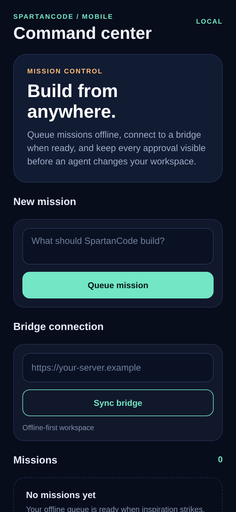
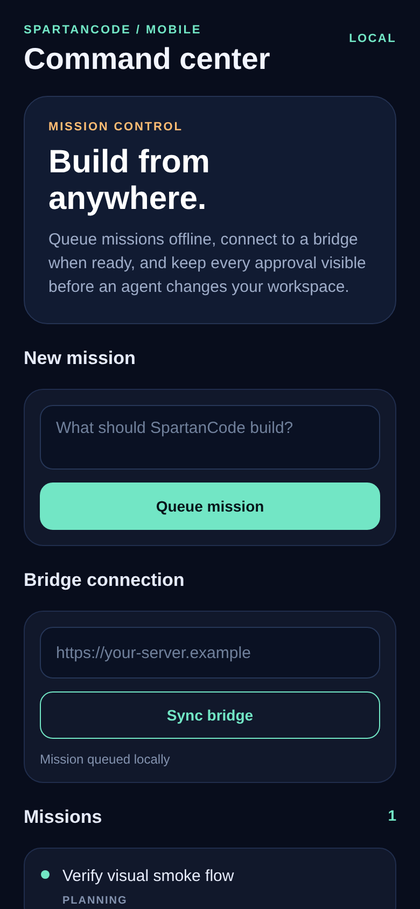

# SpartanCode Desktop

SpartanCode is an agent-first, local-first Vibe coding command center. It is
designed around missions, agent stages, artifacts, approvals, and workspace
handoff rather than a conventional editor layout.

## Development

```bash
npm install
npm run dev
```

The desktop shell uses Electron with a context-isolated preload bridge. Mission
state is persisted in the Electron user-data directory. Local workspace tools
are restricted to the selected workspace, including symlink escape protection.

## Source of truth and development synchronization

`origin/main` on GitHub is the canonical SpartanCode source of truth:
<https://github.com/Spartan-Software-Enterprises/SpartanCode>. The AWS
development checkout is a validation mirror, not an independent branch. The
active replacement host must be supplied through the documented operational
environment; the former `54.152.46.218` checkout is retired.

Before starting work, update local `main` from `origin/main`. Before handing
off work, commit all intended changes, push `main`, fast-forward the AWS
checkout, and verify that both checkouts report the same commit. Never force
push, reset a worktree, or overwrite uncommitted changes to resolve drift.
The detailed procedure, recovery steps, and verification commands are in
[`docs/SYNC_WORKFLOW.md`](docs/SYNC_WORKFLOW.md).

All work must finish with a clean local and AWS worktree. If a conflict or
unexpected change is found, stop and preserve the divergent commit or worktree
before reconciling it.

## Verification

```bash
npm test
```

The suite validates the IPC-facing services, mission lifecycle, policy gates,
model licensing rules, workspace isolation, persistence, renderer parsing, and
formatting.

The repeatable Android baseline and environment-gap report can be generated
with:

```bash
node android/scripts/verify-matrix.js --output dist/android-verification.json
```

The same baseline runs in `.github/workflows/verify.yml`. Device, signing, and
remote-host checks are recorded as explicit skips until their release
environment is supplied.

## Production build

```bash
npm run build   # unpacked Linux application directory
npm run dist    # Linux installer/artifact
```

Electron Builder writes output to `dist/`. Native optional SSH acceleration is
not required for packaging; the SSH transport remains available through the
portable `ssh2` runtime.

## Product boundaries

- Local-first operation remains available without cloud credentials.
- External mutations and dangerous commands require an explicit approval.
- Only explicitly licensed local models are exposed by the model catalog.
- Runtime availability is detected honestly; optional model runtimes are never
  reported as ready until their adapter contract is installed and verified.
- Desktop can invoke a configured llama.cpp CLI with validated model and prompt
  arguments; Android-native MLC/PocketPal runtimes remain optional adapters.
- Android release builds include the MIT-licensed `@pocketpalai/llama.rn`
  adapter through Expo prebuild. It activates only in a native binary with a
  compatible local GGUF model; Expo Go and unsupported devices report it as
  unavailable.
- The optional MCP Bridge can validate RS256 OIDC tokens when
  `SPARTANCODE_BRIDGE_OIDC_ISSUER` and
  `SPARTANCODE_BRIDGE_OIDC_AUDIENCE` are configured, deriving least-privilege
  scopes from standard `scope`/`scp` claims.
- Remote profiles never persist passwords, private keys, or tokens.
- The renderer does not expose Node.js or filesystem primitives directly.
- Collaboration sessions use versioned, auditable events with conflict
  detection and idempotent merge; authenticated MCP Bridge routes can sync
  participants and events without making the bridge mandatory for Android-only
  local planning.
- Audit exports are bounded, credential-redacted, and SHA-256 verifiable through
  desktop IPC and the authenticated bridge.

## Custom agents

Workspace-scoped Antigravity-compatible agents live under
`.agents/agents/<name>/agent.md`. SpartanCode discovers their YAML frontmatter,
scopes their declared tools and execution policy, and includes the safe public
metadata in mission plans. The repository includes Researcher, Implementer,
Verifier, and Sync Guardian roles. Invalid or oversized definitions are ignored
without blocking application startup.

## Plugins

Workspace plugin metadata may be placed under
`.spartancode/plugins/*.json` or `.spartancode/plugins/<id>/plugin.json`.
SpartanCode validates the ID, semantic version, explicit MIT/Apache-2.0
license, and bounded capability list before exposing metadata through the
isolated API. Discovery never executes plugin code; shell and arbitrary
network capabilities are not accepted by the registry.

A signed HTTPS marketplace index can also be fetched through the isolated API.
It verifies an Ed25519 signature, license, capabilities, source URL, and
artifact SHA-256 metadata; marketplace fetching does not download or execute
plugin code.

## Execution modes

Desktop settings provide `Guided` and opt-in `YOLO` execution modes. Guided mode
pauses before policy-classified risky missions. YOLO mode is for trusted,
isolated workspaces and proceeds without interactive approval prompts while
recording the mode and policy bypass in the mission activity log. It does not
remove validation, workspace isolation, credential redaction, or audit history.

## Android

The Android companion follows the Android-first phases in the authoritative
[`vibe-coding-export.txt`](vibe-coding-export.txt). The maintained delivery
contract, acceptance criteria, and test matrix are in
[`android/PLAN.md`](android/PLAN.md).

### Verified Android interface

These screenshots were captured by Playwright against the exported Android
companion web surface at a 390×844 device viewport. The smoke test asserted the
command-center shell and queued a mission through the visible controls.





The current Android interface description and verification record are in
[`android/ABOUT.md`](android/ABOUT.md).

The evidence-based implementation and release-gate matrix is in
[`docs/ROADMAP_STATUS.md`](docs/ROADMAP_STATUS.md). Product privacy,
biometric, model-license, and release obligations are recorded in
[`docs/COMPLIANCE.md`](docs/COMPLIANCE.md).

Android bundles the same core roles and remains fully usable without the desktop
application, an MCP Bridge, or network access. A bridge is an optional route
for remote execution and synchronization only; local planning, queueing,
policy-visible approvals, and review do not depend on it.

Bridge-secret access on Android can optionally require the device biometric or
passcode prompt. The app receives only the authentication result; it never
stores or processes raw biometric data, and offline missions remain available
when biometric hardware is unavailable.

### Remote planning

Desktop settings provide non-destructive planning tools for DigitalOcean,
Linode, Vultr, Hetzner, and AWS server templates. Estimates show the assumed
hourly rate and exclusions before a server is created. Home-server guidance
covers private Tailscale access, temporary ngrok tunnels, and UPnP forwarding
with explicit exposure warnings. SpartanCode does not create provider
accounts, open router ports, or execute setup scripts without a separate,
user-directed integration.
