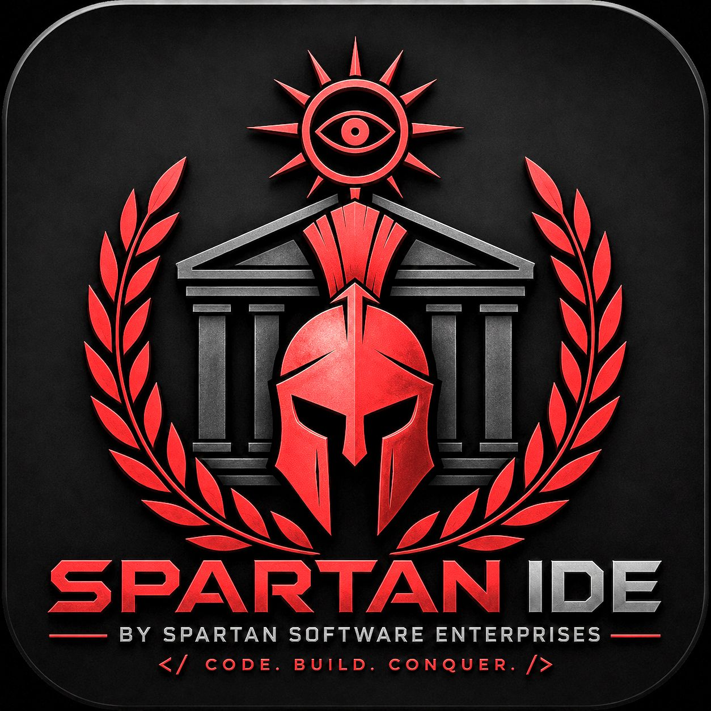
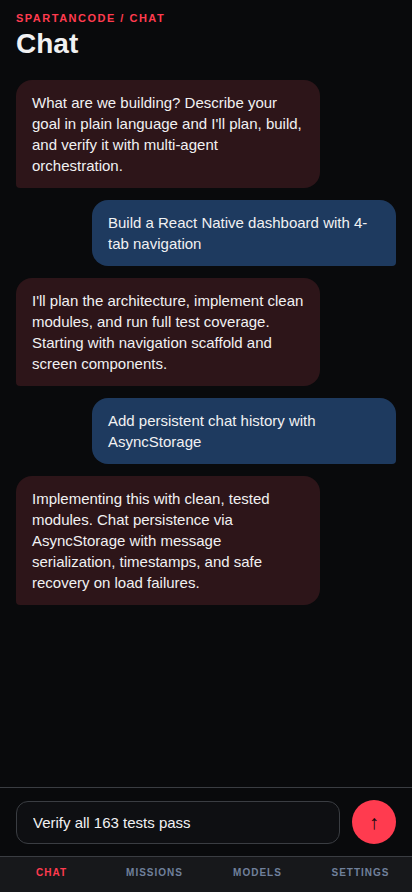
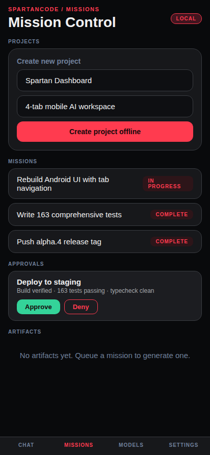
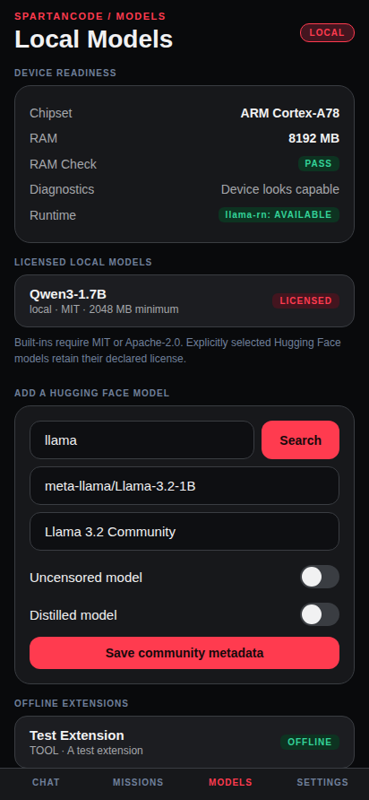
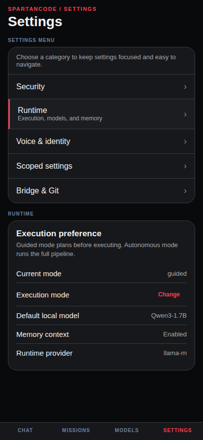

<p align="center">
  
</p>

# SpartanCode

Your local-first AI coding workspace. Run missions, manage agents, browse models, and ship code from desktop or Android — no cloud required.


## What it does

- **Mission-driven development** — describe the outcome, follow planning, implementation, and verification as visible stages
- **12 built-in local models** — Qwen, Phi, Llama, Gemma, Mistral, CodeLlama, DeepSeek, SmolLM, and more
- **Auto-updater** — checks GitHub Releases for new versions on launch, one-click install on all platforms
- **GitHub integration** — browse repos, issues, and pull requests, create issues from Android
- **Custom agents** — spawn subagents for parallel tasks, route work to specialized planners
- **Artifact review** — stage changes, review diffs, approve or reject before commit
- **Bridge mode** — optional remote server for team collaboration and CI integration
- **Offline-first** — local workspaces, encrypted memory, and offline planning work without a network

## Screenshots

| Command center                                                       | Projects                                                           | Agent manager                                                         |
| -------------------------------------------------------------------- | ------------------------------------------------------------------ | --------------------------------------------------------------------- |
|  |  |  |

| Chat | Missions | Models | Settings |
| ---- | -------- | ------ | -------- |
|  |  |  |  |

## Downloads

Latest release: **v0.1.0-alpha.5**

| Platform | Installer | Size |
| -------- | --------- | ---- |
| Windows | [SpartanCode Setup 0.2.0.exe](https://github.com/Spartan-Software-Enterprises/SpartanCode/releases/download/v0.1.0-alpha.5/SpartanCode.Setup.0.2.0.exe) | 96 MB |
| Linux (AppImage) | [SpartanCode-0.2.0.AppImage](https://github.com/Spartan-Software-Enterprises/SpartanCode/releases/download/v0.1.0-alpha.5/SpartanCode-0.2.0.AppImage) | 123 MB |
| Linux (deb) | [desktop-implementation_0.2.0_amd64.deb](https://github.com/Spartan-Software-Enterprises/SpartanCode/releases/download/v0.1.0-alpha.5/desktop-implementation_0.2.0_amd64.deb) | 96 MB |
| Android | [SpartanCode-v0.2.0-release.apk](https://github.com/Spartan-Software-Enterprises/SpartanCode/releases/download/v0.1.0-alpha.5/SpartanCode-v0.2.0-release.apk) | 127 MB |

All apps auto-check for updates on launch. New installs overwrite old versions.

## Tech stack

**Desktop:** Electron 43, vanilla JS, local GGUF runtime  
**Android:** React Native / Expo, TypeScript, Jest  
**Models:** llama.rn, MLC, PocketPal adapters  
**Build:** electron-builder, Expo prebuild, Gradle  

## Repository structure

```
SpartanCode/
├── src/main/          # Electron main process (50+ modules)
├── src/renderer/      # Desktop UI (single-file dark theme)
├── android/           # React Native app (4-tab: Chat, Missions, Models, Settings)
├── docs/              # Architecture and capability docs
└── scripts/           # Build, test, and release tooling
```

## Development

```bash
# Desktop
npm install
npm test          # 233 tests
npm run dev       # Launch Electron

# Android
cd android
npm install
npm test          # 175 tests
npx expo start    # Dev server
```

## License

ISC
